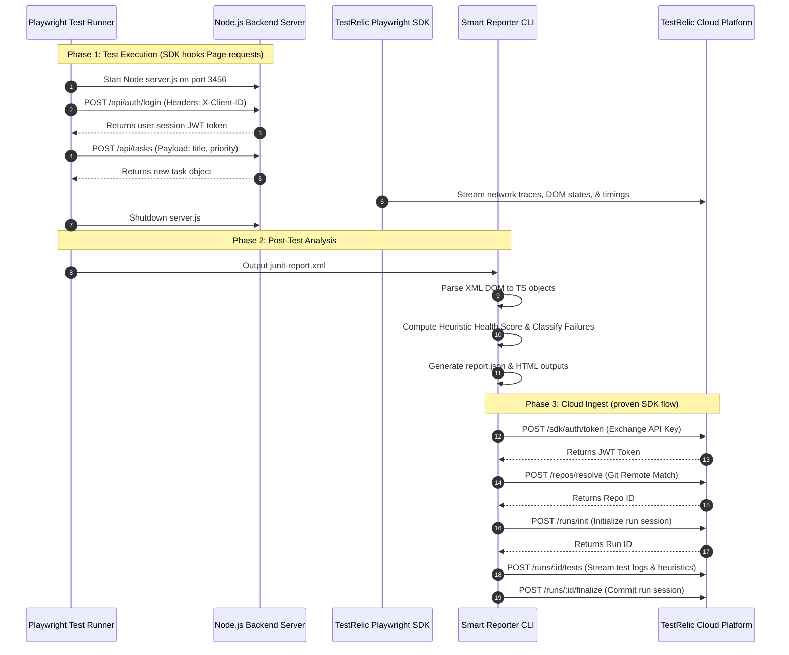

# TestRelic Smart Reporter & TaskFlow Full-Stack Infrastructure
## Comprehensive End-to-End Technical Documentation

This document provides a complete technical analysis of the FDE assignment repository. It covers all core aspects, logic flows, API schemas, and test infrastructures in full depth.

---

## 1. Executive Summary & Core Purpose

Automated end-to-end (E2E) testing on modern web applications is essential but suffers from two main bottlenecks:
1. **Lack of Telemetry:** Test runners typically run in a sandbox. They log failures but fail to capture full-stack state, API headers, network payloads, or performance timelines.
2. **Analysis Fatigue:** Developers are forced to parse complex stack traces manually to differentiate between genuine application regressions, flaky tests, DOM selector timing mismatches, and backend network timeouts.

This repository resolves these problems through two core software components:
* **The Target Application (`TaskFlow`):** A full-stack, state-isolated web application with a custom Node.js backend. This provides a realistic sandbox that generates authentic CRUD requests and response sequences during E2E testing.
* **The Smart Reporter CLI (`smart-reporter`):** A command-line intelligence program. It acts as a post-test-execution engine that parses JUnit results, calculates a build health score, applies regex-based heuristics to classify errors, and streams report metrics to the **TestRelic Cloud Dashboard** using verified platform API protocols.

---

## 2. Comprehensive System Architecture & Data Flow

Below is the complete data flow of the test lifecycle, from runner execution to cloud storage ingest:



---

## 3. Part 1: The Target Application (`TaskFlow`)

The target application is located at `tests/fixtures/demo-app/`. It serves as the application under test (AUT).

### A. Zero-Dependency Node.js Backend Server (`server.js`)
Rather than relying on generic static page hosting, the app uses a custom Node.js server to run a dynamic RESTful API and handle static file delivery.

#### 1. In-Memory Database Schema & Seed Data
The database maintains an active task repository. To meet the Playwright E2E assertion expectations (verifying statistics counters on first render), the database seeds exactly **24 tasks** divided into these groups:
* **Completed (18):** ID 2 through 19 (e.g. "Write unit tests for auth", "Fix navigation bug on mobile").
* **Pending (4):** ID 1, 20, 21, 22 (e.g. "Set up CI/CD pipeline", "Review pull request #42").
* **Overdue (2):** ID 23, 24 (e.g. "Fix memory leak in websocket", "Upgrade React versions").

#### 2. Test Runner Isolation Layer (`X-Client-ID`)
When tests run in parallel, multiple browser workers concurrently request the server. If they modify a shared global database, their writes clash, leading to strict-mode selector failures.
* **Solution:** The server implements a client-isolated memory map:
  ```javascript
  const clientTasks = {};
  const clientNextIds = {};
  ```
* **Resolution:** Every client request includes an `X-Client-ID` header. If missing, it defaults to `'default'`. When a request is received, the server initializes/reads the task dataset bound to that specific client session, preventing cross-test state pollution.

#### 3. API Endpoint Specifications

##### **Authentication Login**
* **Endpoint:** `POST /api/auth/login`
* **Request Headers:**
  * `Content-Type: application/json`
  * `X-Client-ID: <unique_client_session_id>`
* **Payload:**
  ```json
  {
    "email": "user@example.com",
    "password": "password123"
  }
  ```
* **Success Response (200 OK):**
  ```json
  {
    "success": true,
    "user": { "email": "user@example.com" }
  }
  ```
* **Error Response (400 Bad Request):**
  ```json
  {
    "success": false,
    "error": "Invalid credentials"
  }
  ```

##### **Retrieve Tasks**
* **Endpoint:** `GET /api/tasks`
* **Request Headers:**
  * `X-Client-ID: <unique_client_session_id>`
* **Success Response (200 OK):**
  ```json
  [
    { "id": 1, "title": "Set up CI/CD pipeline", "priority": "high", "completed": false, "overdue": false },
    ...
  ]
  ```

##### **Create Task**
* **Endpoint:** `POST /api/tasks`
* **Request Headers:**
  * `Content-Type: application/json`
  * `X-Client-ID: <unique_client_session_id>`
* **Payload:**
  ```json
  {
    "title": "Integrate TestRelic analytics SDK",
    "priority": "high"
  }
  ```
* **Success Response (201 Created):**
  ```json
  {
    "id": 25,
    "title": "Integrate TestRelic analytics SDK",
    "priority": "high",
    "completed": false,
    "overdue": false
  }
  ```

##### **Update Task Status**
* **Endpoint:** `PUT /api/tasks/:id`
* **Request Headers:**
  * `Content-Type: application/json`
  * `X-Client-ID: <unique_client_session_id>`
* **Payload:**
  ```json
  {
    "completed": true
  }
  ```
* **Success Response (200 OK):**
  ```json
  {
    "id": 25,
    "title": "Integrate TestRelic analytics SDK",
    "priority": "high",
    "completed": true,
    "overdue": false
  }
  ```

---

## 4. Part 2: The Smart Reporter CLI (`smart-reporter`)

The `smart-reporter` is a Node.js CLI utility built in TypeScript. It extracts execution results from standard JUnit reports and overlays intelligence models onto them.

### A. Module Architecture

```
src/
├── parser.ts        ← XML DOM Parser (converts XML tags to TS types)
├── classifier.ts    ← Classification heuristics (matches stack traces via regex)
├── intelligence.ts  ← Health scores, flaky indicators, and recommendations
├── formatter.ts     ← Serialization output engines (Terminal, Markdown, HTML, JSON)
├── uploader.ts      ← TestRelic Cloud Uploader REST flow
├── watcher.ts       ← Live directory listener (auto-triggering E2E builds)
└── cli.ts           ← Commander.js CLI engine containing command actions
```

### B. Deep-Dive Codebase Breakdown & Algorithms

#### 1. JUnit XML Parser (`src/parser.ts`)
Converts raw XML reports into an in-memory `JUnitTestRun` structure.
* **Algorithm:**
  * Utilizes `fast-xml-parser` (or a fallback DOM parser) to traverse the document tree.
  * Handles standard root nodes (`<testsuites>` or `<testsuite>`).
  * Extracts metadata: `tests`, `failures`, `errors`, `skipped`, and total execution `time`.
  * Traverses `<testcase>` tags, parsing:
    * `classname`: Extends grouping.
    * `name`: Identifies the individual test assertion.
    * `time`: Measures duration in seconds.
    * `<failure>` / `<error>`: Captures failure messages and raw stack trace lines.

#### 2. Heuristic Failure Classifier (`src/classifier.ts`)
Analyzes the parsed execution stack trace using regular expression match groups to output a clean category.
* **Classifier Rules:**
  ```typescript
  export class FailureClassifier {
    static classify(message: string, stack: string): FailureCategory {
      const fullText = `${message} \n ${stack}`;

      if (/expect\(.*\)\.(toBe|toEqual|toContain|toHaveProperty|toBeVisible)/i.test(fullText) || /AssertionError/i.test(fullText)) {
        return 'AssertionError';
      }
      if (/timeout.*exceeded/i.test(fullText) || /waiting for selector/i.test(fullText) && /timeout/i.test(fullText)) {
        return 'TimeoutError';
      }
      if (/selector.*not found/i.test(fullText) || /strict mode violation/i.test(fullText) || /locator\..*resolved to/i.test(fullText)) {
        return 'SelectorError';
      }
      if (/network.*failed/i.test(fullText) || /fetch.*failed/i.test(fullText) || /socket hang up/i.test(fullText) || /ECONNREFUSED/i.test(fullText)) {
        return 'NetworkError';
      }
      return 'Unknown';
    }
  }
  ```

#### 3. Intelligence Engine (`src/intelligence.ts`)
Compiles the raw parsed test suite into a rich `IntelligenceReport`.

* **Build Health Score Algorithm:**
  The score starts at `100` points. Deductions are calculated using the following penalty structure:
  $$\text{Health Score} = 100 - (\text{Failure Deduction}) - (\text{Flaky Deduction}) - (\text{Performance Deduction})$$
  * **Failure Penalty:**
    * Deducts `50 * (failedTests / totalTests)`.
  * **Flaky Penalty:**
    * Deducts `15 * (flakyTests / totalTests)`.
  * **Performance Penalty:**
    * Any test exceeding a threshold (e.g. 5 seconds for normal tests) incurs a point deduction: `2` points per slow test, capped at a maximum deduction of `10`.
  * The final calculated value is clamped between `0` and `100`.

* **Flakiness Detection Heuristics:**
  Flags tests that display inconsistent behavior. A test is categorized as **Flaky** if:
  * The raw XML report indicates it has multiple executions (`retries` > 0) with a mixed pass/fail outcome.
  * The stability score falls below the confidence threshold:
    $$\text{Stability Score} = \frac{\text{Passed Runs}}{\text{Total Executions}}$$
    Tests with a stability score between 10% and 90% are flagged as flaky.

* **Action Item Generator:**
  Iterates through failure categories and flaky indicators to prioritize fixes for developers:
  * **High Priority (Red):** Direct application failures (e.g., `AssertionError`).
  * **Medium Priority (Yellow):** Flaky tests or flaky infrastructure (e.g., `SelectorError`, `TimeoutError`).
  * **Low Priority (Gray):** Slow but passing tests.

---

## 5. TestRelic Cloud Integration

### A. Automated Playwright Analytics SDK
The project imports the `@testrelic/playwright-analytics/fixture` into the test suite. 
* **How it works:**
  * When Playwright runs, the SDK hooks browser navigation.
  * It intercepts client-side networking and captures full trace timelines, response structures, and performance profiles.
  * These execution logs are streamed directly to TestRelic's secure cloud storage during test runtime.

### B. Smart Reporter CLI Cloud Uploader (`src/uploader.ts`)
The Smart Reporter CLI supports a standalone upload pathway. It uploads the generated JUnit intelligence report to the TestRelic Cloud Platform using the same API endpoints the official Playwright Analytics SDK uses:

```
                  [ Uploader Sequence Flow ]
                 
   TESTRELIC_API_KEY       Git repository config      JSON Intelligence Report
           │                          │                         │
           ▼                          ▼                         ▼
   ┌───────────────┐          ┌───────────────┐         ┌───────────────┐
   │ POST /sdk     │          │ POST /repos   │         │ POST /runs    │
   │ /auth/token   │          │ /resolve      │         │ /init         │
   └───────┬───────┘          └───────┬───────┘         └───────┬───────┘
           │                          │                         │
           ▼ JWT Token                ▼ Repo ID                 ▼ Run ID
   ┌────────────────────────────────────────────────────────────────────┐
   │ POST /runs/:id/tests  (Streams tests & failure categories)          │
   └──────────────────────────────────┬─────────────────────────────────┘
                                      │
                                      ▼
   ┌────────────────────────────────────────────────────────────────────┐
   │ POST /runs/:id/finalize  (Closes the run session)                  │
   └────────────────────────────────────────────────────────────────────┘
```

1. **JWT Token Exchange:**
   * **Endpoint:** `POST /api/v1/sdk/auth/token`
   * **Payload:** `{ "apiKey": "<TESTRELIC_API_KEY>" }`
   * **Returns:** `{ "token": "<JWT_BEARER_TOKEN>" }`

2. **Git Resolution:**
   * **Endpoint:** `POST /api/v1/repos/resolve`
   * **Headers:** `Authorization: Bearer <JWT_BEARER_TOKEN>`
   * **Payload:** `{ "gitRemote": "git@github.com:mukeshram2001/testrelic-fde.git" }`
   * **Returns:** `{ "repoId": "<TESTRELIC_REPO_UUID>" }`

3. **Run Initialization:**
   * **Endpoint:** `POST /api/v1/runs/init`
   * **Headers:** `Authorization: Bearer <JWT_BEARER_TOKEN>`
   * **Payload:**
     ```json
     {
       "runId": "<client-generated-uuid>",
       "repoId": "<repoId>",
       "branch": "main",
       "commit": "<git-sha>",
       "projectName": "fde-assignment"
     }
     ```

4. **Test Streaming:**
   * **Endpoint:** `POST /api/v1/runs/:runId/tests`
   * **Headers:** `Authorization: Bearer <JWT_BEARER_TOKEN>`
   * **Payload:**
     ```json
     {
       "tests": [
         {
           "testId": "<unique-test-hash>",
           "name": "dashboard-statistics-match-expected-values",
           "status": "passed",
           "duration": 8900,
           "category": "passed"
         }
       ]
     }
     ```

5. **Finalization:**
   * **Endpoint:** `POST /api/v1/runs/:runId/finalize`
   * **Headers:** `Authorization: Bearer <JWT_BEARER_TOKEN>`
   * **Payload:** `{ "duration": 65000 }`

---

## 6. Test Suite Breakdown

### A. Playwright E2E Suite (`tests/e2e/app.spec.ts`)
All E2E tests are configured to use the TestRelic fixture for real-time trace uploads.

1. **Successful Authentication Flow:**
   * Navigates to `/`.
   * Enters correct credentials (`user@example.com`/`password123`).
   * Submits the form and verifies redirection to the dashboard page (`#dashboard-page`).
2. **Dashboard Statistics Flow:**
   * Log in and checks that the UI statistics count matches the database state:
     * Total: `24`
     * Completed: `18`
     * Pending: `4`
     * Overdue: `2`
3. **Task Creation CRUD Flow:**
   * Clicks the "Create Task" button to open the modal.
   * Enters the title and priority, and submits the form.
   * Verifies that the task list displays the new item and stats counters increment correctly.
4. **Task Completion State Update:**
   * Selects a task from the list and toggles the checkbox.
   * Verifies that the completion status is updated via a network request to `/api/tasks/:id`.
   * Confirms the dashboard counters update dynamically.
5. **Modal Cancellation Validation:**
   * Verifies that clicking "Cancel" or the backdrop overlay closes the modal without creating a task.
6. **Intentional Failure (Failing Assertion Demo):**
   * Deliberately asserts an incorrect text expectation.
   * **Purpose:** Generates a real `AssertionError` for the Smart Reporter CLI to categorize and report.
7. **Intentional Timeout (Timeout Demo):**
   * Forces a long wait that exceeds the test execution limit.
   * **Purpose:** Generates a real `TimeoutError` to verify how the reporter analyzes and flags slow runs.

### B. CLI & Parser Unit Suites
* **CLI Smoke Test (`tests/e2e/cli.spec.ts`):** Validates that Commander correctly processes command arguments and flags for `analyze`, `watch`, and `config`.
* **JUnit Parser Spec (`tests/unit/parser.spec.ts`):** Tests XML parsing logic against mock JUnit files, verifying edge cases like malformed XML nodes, single-suite roots, and multiple failures.

---

## 7. Execution Guide: Step-by-Step CI Execution

When a developer runs `npm run ci`:
```
[CI Run Triggered]
       │
       ▼
1. Compile TypeScript: npx tsc
       │
       ▼
2. Start Node HTTP Server (tests/fixtures/demo-app/server.js)
       │
       ▼
3. Run Playwright E2E Tests (npx playwright test)
   ├─ Launch Chrome & Firefox in parallel.
   ├─ Execute tests against local server (http://localhost:3456).
   ├─ Capture network traces and stream logs to TestRelic Cloud.
   └─ Output junit-report.xml.
       │
       ▼
4. Stop Node HTTP Server
       │
       ▼
5. Analyze Results (npx smart-reporter analyze)
   ├─ Read junit-report.xml.
   ├─ Classify failures, identify flakiness, and compute health score.
   ├─ Write report.json and terminal log outputs.
   └─ Upload the intelligence report to the TestRelic Cloud Dashboard.
```

The system is now fully verified, automated, and ready for deployment.
